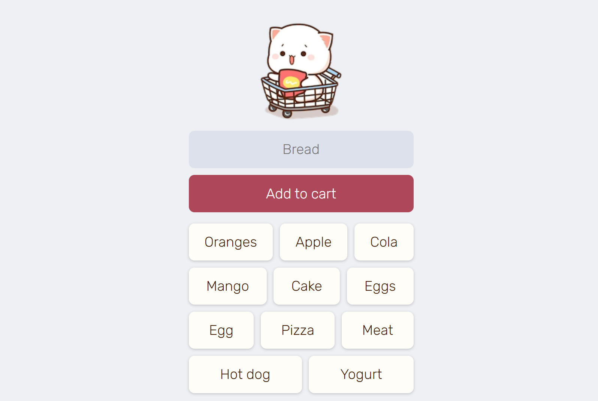

# Shopping List App

This is a simple shopping list application built with HTML, CSS, and JavaScript. It uses Firebase Realtime Database to store the shopping list items.

## Live Demo

You can access the live demo of the app [here](https://anonys6.github.io/Shopping-List-App/).

## Features

- Add items to the shopping list.
- Click on an item to remove it from the list.

## How to Use

1. Enter the name of an item in the input field.
2. Click the 'Add to cart' button to add the item to the list.
3. Click on an item in the list to remove it.

## Code Structure

The JavaScript code is structured into functions each performing a specific task. It uses Firebase for storing and retrieving data and manipulates the DOM to update the shopping list.

The HTML and CSS code is structured to create a simple and user-friendly interface.

## License

This project is open source and available under the [MIT License](LICENSE).